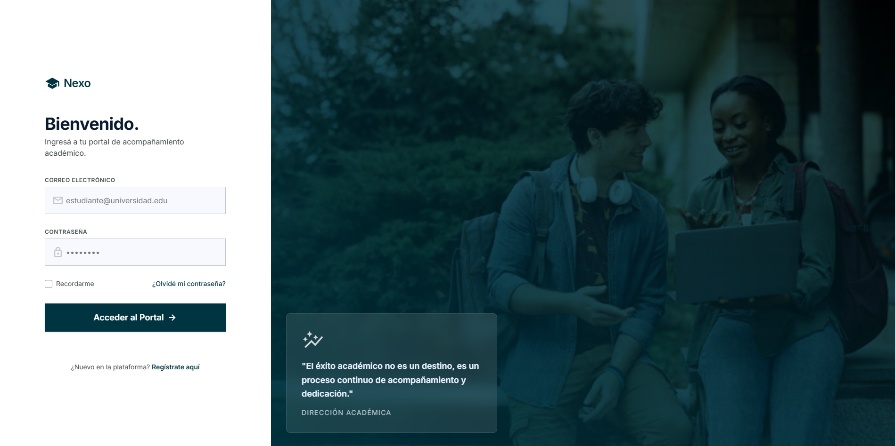
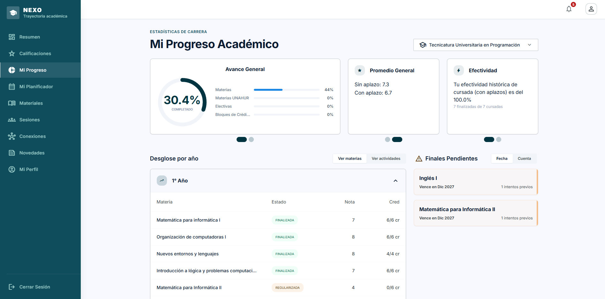
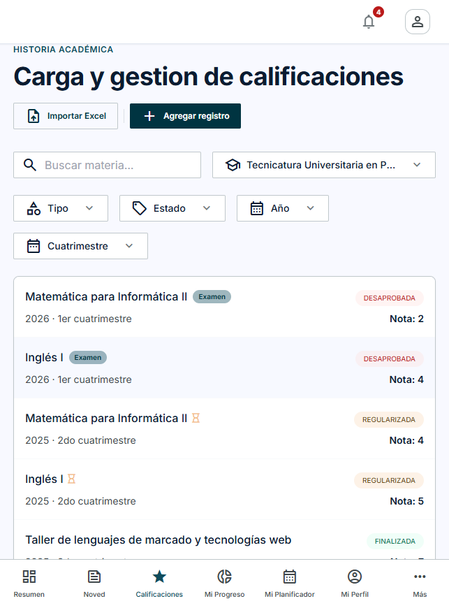

# DesApp (AcademiaPro)

Plataforma de gestión académica para estudiantes universitarios. Permite armar y seguir el plan de estudios de una carrera, controlar correlatividades, registrar el avance académico (materias regularizadas, aprobadas, finales) y organizar sesiones de estudio, además de un espacio social liviano (posts, comentarios, conexiones entre estudiantes) para coordinar con compañeros.

Proyecto desarrollado para la materia **Desarrollo de Aplicaciones** (Tecnicatura Universitaria).

## Integrantes

- Kevin Caria
- Lautaro Olivera
- Martín Lubris
- Ezequiel Ortiz
- Leandro Cantero

## Capturas

| Login | Mi Progreso Académico | Historia Académica (mobile) |
|---|---|---|
|  |  |  |

## ¿Qué se puede hacer?

La app tiene dos roles con vistas y permisos distintos: **estudiante** y **admin**.

### Como estudiante

- Ver un **resumen** general de su situación académica.
- Cargar y gestionar su **historia académica**: notas de exámenes, cursadas regularizadas/finalizadas, importación masiva por Excel.
- Consultar **Mi Progreso**: avance por carrera (materias, electivas, bloques de crédito), promedio general y finales pendientes con fecha de vencimiento.
- Armar su propio recorrido de cursada en **Mi Planificador**, respetando correlatividades.
- Consultar **materiales** de estudio compartidos y **sesiones de estudio** (crearlas, inscribirse, aprobar inscripciones).
- Conectarse con otros estudiantes (**conexiones**) y ver **novedades** (posts, comentarios, votos).
- Configurar su **perfil**: privacidad (perfil público, mostrar situación académica) y datos de carrera.

### Como admin

- Ver un **dashboard** general de la plataforma.
- Gestionar **institutos**, **carreras**, **planes de estudio**, **materias** y **actividades**.
- Administrar el **directorio** de usuarios.
- **Moderar** contenido reportado por la comunidad (posts, comentarios).
- Configurar parámetros generales del sistema.

## Estructura del repositorio

Monorepo con dos proyectos independientes:

```
App/
├── backend/   # API REST - Node.js, Express, Sequelize, PostgreSQL
└── frontend/  # SPA - React, Vite, Tailwind CSS
```

Cada carpeta tiene su propio `README.md` con instrucciones detalladas de instalación, variables de entorno, testing y despliegue:

- [backend/README.md](backend/README.md)
- [frontend/README.md](frontend/README.md)

## Levantar el proyecto en local (resumen)

1. **Backend**
   ```bash
   cd backend
   npm install
   cp .env.example .env   # completar credenciales de DB
   npm run db:prepare     # levanta Postgres (Docker) y carga datos de prueba
   npm run dev             # http://localhost:3001
   ```
2. **Frontend**
   ```bash
   cd frontend
   npm install
   cp .env.example .env   # VITE_API_URL apuntando al backend
   npm run dev              # http://localhost:3000
   ```

Ver los README de cada carpeta para detalle de credenciales de prueba, testing y documentación de la API (Swagger en `/api/docs`).

## Stack tecnológico

| | Backend | Frontend |
|---|---|---|
| Runtime | Node.js | - |
| Framework | Express | React |
| Build/Dev | nodemon | Vite |
| Estilos | - | Tailwind CSS |
| ORM/DB | Sequelize + PostgreSQL | - |
| Auth | JWT | - |
| Testing | Jest | Vitest + Testing Library + MSW |

## Despliegue

- **Backend**: pensado para Render (Web Service) — soporta `PORT` dinámico, SSL de base de datos gestionada (`DB_SSL`) y Cloudinary para almacenamiento persistente de imágenes.
- **Frontend**: SPA estática, servible en Render (Static Site) o Vercel — requiere configurar `VITE_API_URL` apuntando a la URL pública del backend.
